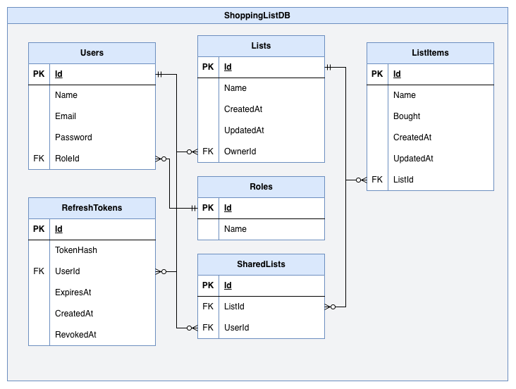

# ShoppingList_WebAPI

REST API for a shared shopping list app. Users create lists, share them with
others, and see changes in real time.

Built with ASP.NET Core (.NET 10), PostgreSQL and Entity Framework Core.

## Features

- JWT authentication with refresh token rotation
- Role-based authorization (user / admin)
- Shared lists with per-user access control
- Rate limiting and API key protection
- Global exception handling

## Tech stack

| | |
|---|---|
| Framework | ASP.NET Core (.NET 10) |
| Database | PostgreSQL + EF Core |
| Auth | JWT (HS256), hashed refresh tokens |
| Docs | OpenAPI / Scalar |
| Hosting | Railway (Docker) |

## Running locally

```bash
dotnet run --project ShoppingList_WebAPI
```

Requires a PostgreSQL instance. Set the connection string in
`appsettings.Development.json`, plus `Jwt:Secret`, `Jwt:Issuer` and
`Jwt:Audience`. Migrations are applied automatically on startup.

API docs are available at `/scalar/v1` in development.

## Database model

